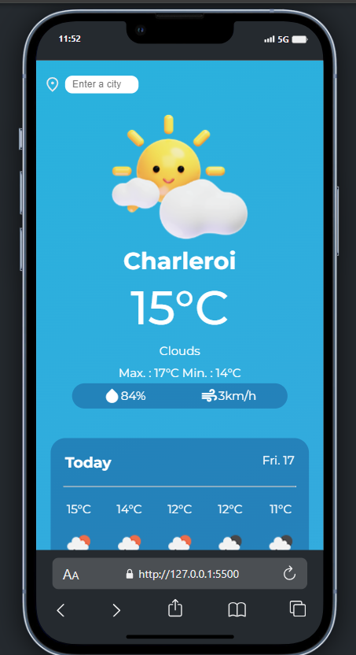

## Weather App

# La mission

Le but de ce projet était de réaliser une petite Weather App

Il fallait que la personne puisse rentrer une ville de son choix et obtenir la météo de l'instant ainsi que les 5 jours suivants.

J'ai également décidé d'implémenter quelques petits bonus : 
- La météo par tranche horaire
- Un graphique de température grâce à la bibliothèque Chart.js
- Une géolocalisation si aucune ville n'a été rentrée (localStorage vide)
- Un changement de thème en fonction de l'heure, on passe en mode nuit lorsqu'il est plus tard que l'heure du couché de soleil

# Visualisation

# Languages utilisés

